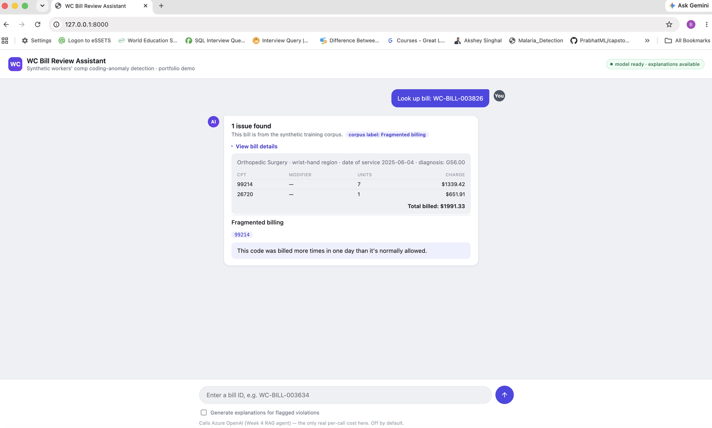
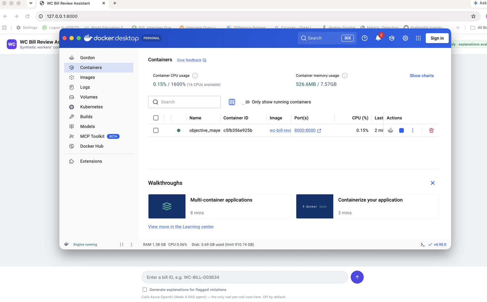

# Demo walkthrough

A five-minute tour of the running app: what to click, what a few example
bills look like, and what each part of the response actually means. If
you just want to get it running, jump to **Quick start**; if it's already
running, skip to **Try it**.

All bills below are from the 100% synthetic corpus this project
generates itself (see `data-generation/DATA_CARD.md`) — no real claims,
providers, or patients anywhere.

## Quick start

**Docker (recommended — no local Python setup needed):**

```bash
docker build -t wc-bill-review-agent .
docker run --rm -p 8000:8000 --env-file agent/.env wc-bill-review-agent
```

Omit `--env-file agent/.env` if you haven't set up Azure OpenAI credentials
yet — everything works except the "Generate explanations" toggle (see
**Generate explanations** below).

**Or, without Docker** (after the `Setup` and steps 1–3 of `Running it end
to end` in the main `README.md`):

```bash
source .venv/bin/activate
uvicorn api.main:app --reload
```

Either way, open **http://127.0.0.1:8000**.

## Try it

Type a bill ID into the box at the bottom and press enter (or click the
arrow). Start with `WC-BILL-003826`:



Here's what's on screen:

- **"1 issue found" / corpus label** — this bill is drawn from the
  training corpus, so alongside the model's own prediction the UI shows
  the ground-truth label it was generated with (`corpus label: Fragmented
  billing`). A bill you construct yourself (via the API directly, not
  this ID-lookup box) wouldn't have this — it's a demo convenience, not
  something a real deployment would have access to.
- **"View bill details"** — click to expand the actual line items (CPT
  code, modifier, units, charge) and total billed for this bill, plus the
  provider specialty, body region, date of service, and diagnosis
  code(s). Collapsed by default so a clean bill's result stays a
  one-line answer.
- **The flagged issue** (`Fragmented billing`) — one row per violation
  type the model flagged (probability ≥ 0.5). A clean bill shows none of
  this section at all.
- **The CPT code chip(s)** (`99214`) — which specific code(s) on *this*
  bill are actually implicated in the flagged issue. This is computed
  locally, for free, by re-running the exact same deterministic rule
  checker the training corpus was labeled with
  (`data-generation/generate_bills.py`'s `violates_any_rule`) against
  this one bill — not a second model call. If the model flags a type but
  that checker doesn't confirm it on this specific bill, the chip and
  explanation are simply absent rather than guessed at: that combination
  is itself a signal of a likely model false positive on that bill.
- **The one-line explanation** ("This code was billed more times in one
  day than it's normally allowed.") — a short, hard-coded, free
  description of what that violation type generally means. Not
  AI-generated; see the next section for the one part of this demo that
  is.

## Generate explanations (optional, costs a small real API call)

Check "Generate explanations for flagged violations" before looking up a
bill and you'll additionally get a longer, *grounded* explanation from
the Week 4 RAG agent: it retrieves the exact rule text this bill actually
violates (an NCCI PTP edit pair, an MUE cap, or the relevant causality/
up-coding principle) from a local vector store, then asks Azure OpenAI to
turn that into plain language referencing this bill's specifics. This is
the only thing in the whole API with a real per-call cost, which is why
it's off by default and always opt-in per request — never something that
fires automatically just because a bill was flagged.

## Example bills to try

One example of each of the four things this project checks for, plus a
clean bill:

| Bill ID | What it demonstrates |
|---|---|
| `WC-BILL-003634` | **Unbundling** — a comprehensive CPT code billed alongside a component code that's already included in it (an NCCI PTP edit pair). |
| `WC-BILL-003826` | **Fragmented billing** — a code billed more times in one day than its Medically Unlikely Edit (MUE) cap allows (the screenshot above). |
| `WC-BILL-003997` | **Causality mismatch** — a procedure billed for a body region that doesn't match any billed diagnosis code. |
| `WC-BILL-003996` | **Upcoding** — an evaluation & management (E/M) code billed at a higher complexity level than the visit supports. |
| `WC-BILL-000066` | **Clean** — the result is just a one-line "No issues found," plus the collapsed bill details above it. |

Want more than five? `GET /bills/{bill_id}` works for any ID in
`data-generation/output/synthetic_bills.jsonl` — bill IDs run from
`WC-BILL-000001` through however many the corpus was generated with (4000
by default; `data-generation/generation_stats.json` has the exact count
and the split by violation type).

## Running it in a container (what the screenshot above shows, containerized)

The same app, packaged so nobody needs to set up a local Python
environment or activate a venv to run it:



See the `Dockerfile` and `.dockerignore` at the project root — notably,
`agent/.env`'s real credentials are never baked into the image; they're
only supplied at `docker run` time via `--env-file`, so the image itself
stays safe to share or push to a registry.

## Other ways in

- **Swagger / interactive API docs**: `http://127.0.0.1:8000/docs` — try
  `/predict`, `/explain`, and `/review` directly, see exact request/response
  schemas, no curl needed.
- **`GET /health`**: liveness + readiness — is the trained model loaded,
  is the CPT-code lookup ready, is Azure OpenAI configured. Never itself
  calls Azure OpenAI, so polling it is always free.

## If something doesn't load

- **Browser says connection refused**: the server process isn't running.
  If you're using the non-Docker path, the terminal running `uvicorn`
  needs to stay open; if using Docker, check `docker ps` shows the
  container.
- **"Generate explanations" errors out**: `agent/.env` isn't filled in,
  or wasn't passed to the container (`--env-file agent/.env`). Check
  `GET /health`'s `rag_env_configured` field — it says exactly what's
  missing without spending any money to check.
